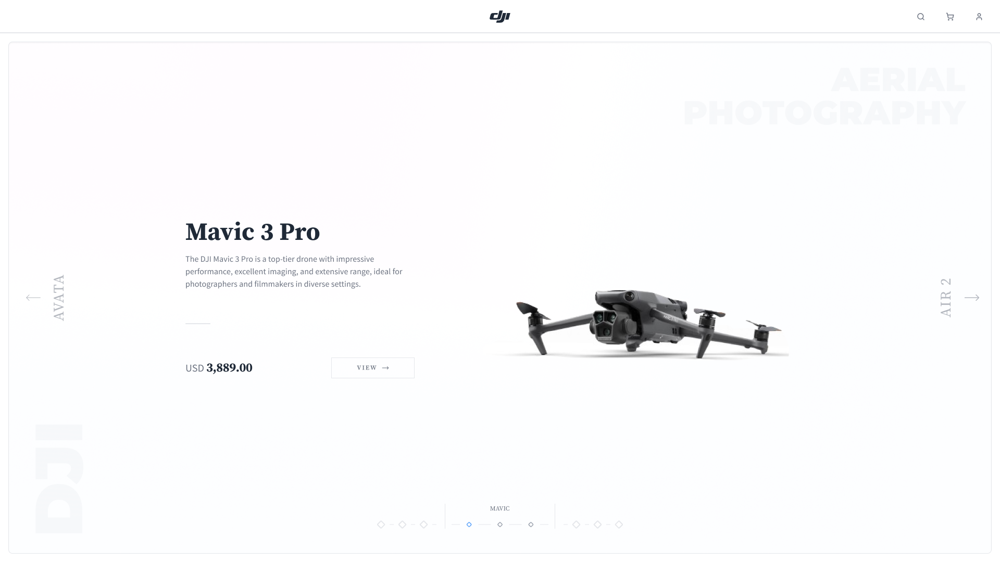
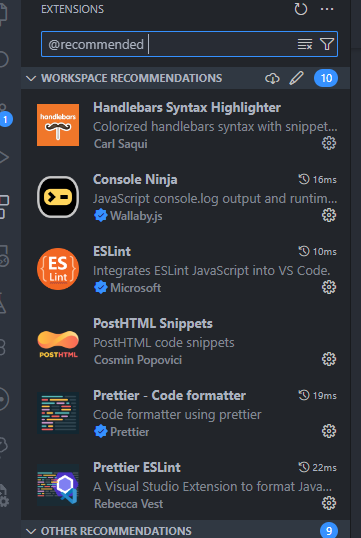

<div align="center">
    
</div>

<br/>

<div align="center">
    <!-- TODO: update version number on every release -->
    
    
</div>

<div align="center">
    <a href="https://app.netlify.com/sites/qu-dji-store/deploys"></a>
    
    
</div>

<br/>

<span align="center">
    <h1><b>DJI Drone Marketplace</b><br/>
    Project Phase 1</h1>

**DJI Drone Marketplace** is an interactive web application that allows users to buy and sell drones. Users can browse
through a variety of drones, view their features and specifications, and place orders. The application also provides a
platform both buyers and sellers to manage their accounts, view their transaction history, and track their orders.

**This project is done as part of the CMPS350 course project under Qatar University.**

</span>

## 🔑 Key Features

-   **User Authentication**: Users can sign up, log in, and log out of their accounts. They can also reset their
    passwords if they forget them.
-   **Drone Listings**: Users can view a list of drones available for purchase in **3D**. They can view details on each
    drone such as its price, features, whats in the box, reviews, and more.
-   **Order Management**: Users can place orders for drones and track their order status. They can also view their order
    history.
-   **Account Management**: Users can view and edit their account details, such as their name, email, and password.
-   **Seller Dashboard**: Sellers can view and manage their drone listings, orders, and account details.

## 📖 Table of Contents

-   [💻 Getting Started](#-getting-started)
    -   [Prerequisites](#1-prerequisites)
    -   [Setting up the project](#2-setting-up-the-project)
    -   [Running the application](#running-the-application)
    -   [Creating a branch for new features](#3-creating-a-branch-for-new-features)
    -   [Committing changes](#4-committing-changes)
    -   [Merging new changes](#5-merging-new-changes)
-   [📦 Bundle Size](#-bundle-size)
-   [📚 Tech Stack](#-tech-stack)
-   [🧩 Components](#-components)
    -   [Creating a new component](#creating-a-new-component)

## 💻 Getting Started

### 1. Prerequisites

First, make sure you have the following installed on your machine:

-   [Node.js](https://nodejs.org/en/download/)
-   [VSCode](https://code.visualstudio.com/download)

And if not already installed, run the following command to globally install `pnpm`:

```shell
npm install -g pnpm
```

---

### 2. Setting up the project

Pull the repository and install the dependencies by opening the folder in VSCode and running the following commands:

```shell
pnpm install
```

Then, with VSCode open, press ctrl + shift + p and type "recommended". Then click on the "Show Recommended Extensions"
option and install all the recommended extensions for the project. You should see the list below in your sidebar:



For the handlebars extension, make sure to press the settings icon, click on "Disable", and then click on "Enable
(Workspace)" to make sure the extension is enabled only for this project. Then, reload VSCode to make sure the changes
have been applied.

---

### Running the application

Once all the dependencies have been installed, start the application by running:

```shell
pnpm dev
```

This will open up the website for local viewing on [localhost:5173](http://localhost:5173/).

If you'd like to build and preview the production version of the application, run the following commands:

```shell
pnpm build
pnpm preview
```

---

### 3. Creating a branch for new features

When working on a new feature, make sure to create a new branch with the following naming convention:

```js
${VERSION_NUMBER}/${TYPE}/${FEATURE_NAME}
```

For example, if you are working on a task under "v0.4.0 - Implement Customer Pages" where you implement a new timeline
component then `${VERSION_NUMBER}` would be `v0.3.x`, `${TYPE}` would be `feat`, and `${FEATURE_NAME}` would be
`implement-timeline-component`.

Another example would be if you are working on a task under "v0.4.0 - Implement Customer Pages" where you have to
refactor the authentication logic then `${VERSION_NUMBER}` would also be `v0.3.x`, `${TYPE}` would be `refactor`, and
`${FEATURE_NAME}` would be `refactor-authentication-logic`.

```js
// v0.3.x/feat/implement-timeline-component
// v0.3.x/refactor/refactor-authentication-logic
```

Note that if there are multiple people working on the same branch, x's are used to indicate that the version number is
not yet known. This will be updated once the feature is merged into the main branch. More on this can be found in the
[Merging new changes](#5-merging-new-changes) section.

---

### 4. Committing changes

When committing changes, make sure to follow the below commit message format:

```js
${TYPE}: ${DESCRIPTION}
```

Where `${TYPE}` is one of the following:

-   `feat` - A new feature
-   `tweak` - Small changes or improvements
-   `refactor` - A code change that neither fixes a bug nor adds a feature
-   `fix` - A bug fix
-   `docs` - Documentation only changes
-   `ci` - Changes to our CI configuration files and scripts (example scopes: Travis, Circle, BrowserStack, SauceLabs)
-   `chore` - Changes to the build process or auxiliary tools and libraries such as documentation generation
-   `test` - Adding missing tests or correcting existing tests
-   `deps` - Add, update, or remove dependencies

And `${DESCRIPTION}` is a brief description of the changes made. Make sure to use the imperative, present tense (e.g.
"Add" not "Added" or "Adds"). Also the description should not start with a capital letter and should not end with a
period. For example:

```js
// testing: Added new tests for some utility function  ❌
// test: add new tests for some utility function  ✅
```

Finally, try to not make commits that are too large. If you are working on a large feature, try to break it down into
smaller tasks and make a commit for each task. This will make it easier to track changes and revert them if necessary.

---

### 5. Merging new changes

When you are done with your feature and are ready to merge it into the main branch, make sure to create a pull request.
The name of the pull request should follow the below format:

```js
#${CLICKUP_TASK_ID}/${VERSION_NUMBER}/${TYPE} - ${FEATURE_NAME}
```

Where `${CLICKUP_TASK_ID}` is the task id from Clickup, `${VERSION_NUMBER}` is the version number of the feature you are
working on, `${TYPE}` is one of the task types from the previous section, and `${FEATURE_NAME}` is a capitalized version
of the branch name.

For example, if you are working on a task under "v0.4.0 - Implement Customer Pages" where you implement a new timeline
component then the pull request name would be:

```js
#abcdefghi/v0.3.x/feat - Implement timeline component
```

Make sure to replace the x's with the actual version number, counting numerically from the last version number. For
example, if the last version number was `v0.3.0` then the next version number would be `v0.3.1`.

For the description of the pull request, use the following template:

```md
**Clickup Link** - https://app.clickup.com/t/CHANGE_THIS

**Overview** EMPTY_DESCRIPTION

<!-- Add picture here -->
```

Make sure to replace `CHANGE_THIS` with the task id from Clickup and `EMPTY_DESCRIPTION` with a brief description of the
changes made. Also, if possible, add a picture of the changes made to the pull request description.

Once ready, assign the pull request to `@MFauzanAP` and wait for the changes to be reviewed and merged.

## 📦 Bundle Size

The below table shows the total bundle size of the application, broken down into the different routes. Each row
represents a route which has a colored indicator showing the performance of that particular route.

<!-- BUNDLE_TABLE_START -->
| | Size | Budget Used (`1 MB`) | 
| --- | :---: | :---: | 
| `total` | `413.6 kB` | 🟡 `41.36%` | 

<!-- BUNDLE_TABLE_END -->

## 📚 Tech Stack

-   **Vite** - Builds and compiles the application, and provides hot module replacement and fast refresh during
    development. Used in particular to simplify tailwindcss, postcss, posthtml, and multi-page routing configuration
-   **TailwindCSS** - A utility-first CSS framework that provides a set of pre-built classes to help build custom
    designs. This was used to reduce some of the headaches involved in writing vanilla CSS and to allow for the use of
    pre-built component libraries.
-   **PrelineUI** - A component library built on top of TailwindCSS that provides a complete set of pre-built components
    and styles to help build custom designs.
-   **Three.js** - A 3D library that provides a set of tools to create and render 3D scenes in the browser. This was
    used to render 3D models of drones in the application.

## 🧩 Components

The components used in this application are built using the new Web Components API. This allows for the creation of
custom native-elements that are simpler and more performant than traditional frameworks like React or Vue. We also had
to use them due to the limitations set for the course project.

Each component extends a base class `BaseComponent.ts` that provides a set of lifecycle methods and properties to help
manage the component's state and behavior. For components that are extensions of the primitive HTML elements such as
`button`, `input`, etc..., we further extend the `PrimitiveComponent.ts` class which forwards some attributes to the
native element encapsulated within the component.

```html
<!-- Changing the custom attribute will reflect the change in the button element -->
<custom-button-element custom-attribute="test">
	<button custom-attribute="test">
		<slot>
	</button>
</custom-button-element>
```

Within the component folder there are 3 main files:

-   `logic.ts` - Contains the logic for the component, such as event listeners, state management, and other methods.
    Also specifies which attributes should be observed and reflected to the native element.
-   `style.css` - Contains the styles for the component. These styles are automatically imported into the main
    stylesheet in the `@components` layer. This fixes the issue of style precedence and allows for the use of tailwind
    utility classes.
-   `template.html` - Contains the HTML template for the component. This is the structure of the component and will be
    rendered in the DOM during runtime.

### Creating a new component

1. Create a new folder in the `src/components` directory with the name of the component. For example, if you are
   creating a new button component, the folder name would be `Button`.
2. Inside the new folder, create the following files:
    - `logic.ts`
    - `style.css`
    - `template.html`
3. In the `logic.ts` file, create a new class that extends the `BaseComponent` class. This class should contain the
   logic for the component, such as event listeners, state management, and other methods. Also specify which attributes
   should be observed and reflected to the native element.
4. In the `style.css` file, create the styles and variants for the component.
5. In the `template.html` file, create the HTML structure for the component. This is the structure of the component and
   will be rendered in the DOM during runtime.
6. Then, import the script inside `src/scripts/index.ts`, the styles inside `src/styles/index.css`, and the template
   inside `src/layouts/base.html`.
7. Finally, add the component to `custom-components.json` to allow for auto-completion and type checking in the editor.
